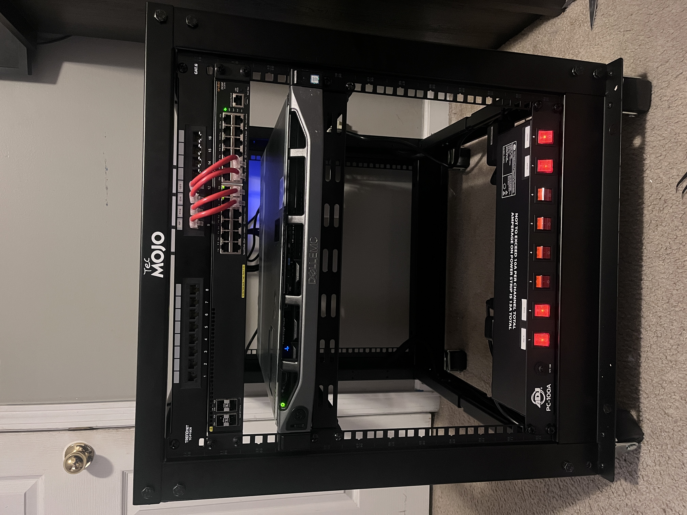

# 12U Rack Home-Lab Project

## Overview

This repository documents the build, configuration, and maintenance of my 12U rack home lab environment. The setup features a comprehensive networking infrastructure with VLAN segmentation, virtualization capabilities, and structured hardware organization—all designed to provide a secure, flexible platform for learning, testing, and hosting various services.

## Table of Contents

- [Hardware Components](#hardware-components)
- [Network Architecture](#network-architecture)
- [VLAN Configuration](#vlan-configuration)
- [Server Specifications](#server-specifications)
- [Virtualization Environment](#virtualization-environment)
- [Installation Process](#installation-process)
- [Future Enhancements](#future-enhancements)
- [Lessons Learned](#lessons-learned)

## Hardware Components

- **Rack:** Tec Mojo 12U Open Server Rack with adjustable depth
- **Server:** Dell PowerEdge R230
- **Switch:** Aruba 2930F (24-port managed switch)
- **Routers:**
  - Asus RT-AX3000 (Primary router/firewall)
  - Asus ExpertWiFi AP (VLAN-capable wireless)
  - Kinetic T3260 (Router/Modem/Bridge)
- **Compute:** Raspberry Pi 5
- **Power:** 8-plug PDU for power distribution
- **Accessories:** Patch panel, custom cables, cable management solutions

## Network Architecture

The network is designed with security and segmentation as core principles. Traffic is segregated into distinct VLANs based on function and security requirements, with the Aruba 2930F switch handling VLAN tagging, trunking, and routing.

### Network Topology Highlights

- **Core switching** provided by Aruba 2930F
- **Multiple wireless networks** through VLAN-tagged SSIDs
- **MAC-based authentication** and access control lists (ACLs) on the Aruba switch
- **Integrated Netgear Orbi system** as dedicated access point (AP mode only)
- **Structured cabling** with patch panel implementation

## VLAN Configuration

| VLAN ID | Name | Subnet | Purpose |
|---------|------|--------|---------|
| 10 | Management | 10.0.10.0/24 | Network monitoring and management access |
| 20 | Homelab | 10.0.20.0/24 | Self-hosted services with no direct internet exposure |
| 30 | Trusted | 10.0.30.0/24 | Private trusted devices with limited access to VLANs 10 and 20 |
| 40 | IoT | 10.0.40.0/24 | Isolated network for Internet of Things devices |
| 50 | Guest | 10.0.50.0/24 | Internet-only access with client isolation |

### VLAN Security Features

- **Management VLAN 10:** Full access to all VLANs for network monitoring and management; no external device access except for authorized administrators
- **Homelab VLAN 20:** Hosts self-hosted services with no direct internet exposure
- **Trusted VLAN 30:** Access to Management VLAN for administration; blocked from IoT VLAN and Guest VLAN
- **IoT VLAN 40:** Internet access for cloud services; isolated from all other VLANs
- **Guest VLAN 50:** Outbound internet access only with DHCP-assigned addressing; client isolation enabled

## Server Specifications

### Dell PowerEdge R230 Server

**Upgraded Components:**
- **CPU:** Intel Xeon E3-1270 V6 (3.80 GHz, 4C/8T)
- **Memory:** 32GB ECC RAM (2x16GB A-TECH UDIMM, dual-channel optimized in A1 & A2 slots)
- **Storage:**
  - 1TB Vulcan Z QLC SATA SSD
  - Crucial MX500 SATA SSD
- **Cooling:** Kryonaut thermal grease for improved heat dissipation
- **Expansion:** Additional bays available for future storage or RAID configurations

## Virtualization Environment

The primary virtualization platform is Proxmox VE, hosting various virtual machines and containers including:

- **PFSense VM:** Firewall and routing
- **OPNSense VM:** Network security
- **NetData VM:** Performance monitoring
- **Libre NMS:** Network monitoring system
- **OpenVPN:** Secure remote access

### Homelab VLAN (20) Services

Hosted on the Dell PowerEdge R230 within dedicated VMs:
- **Linux VM**
- **Windows VM**
- **OpenMediaVault**
- **Zeek:** Network security monitoring
- **Suricata:** Intrusion detection/prevention
- **PiHole:** Network-wide ad blocking
- **Unbound:** DNS resolver

## Installation Process

1. **Rack Assembly and Hardware Installation**
   - Assembled the 12U rack
   - Mounted server, switch, patch panel, and accessories
   - Installed shelves for structured equipment placement
   - Mounted PDU for power distribution

2. **Server Upgrades**
   - Upgraded CPU to Intel Xeon E3-1270 V6
   - Installed 32GB ECC RAM in dual-channel configuration
   - Added SSDs using 3.5" bay holders
   - Applied thermal paste and verified system stability

3. **Network Configuration**
   - Ran Ethernet cables from devices to patch panel
   - Created custom patch cables
   - Punched down wiring to connect patch panel to switch
   - Labeled and organized all cables

4. **VLAN Setup**
   - Configured VLANs on Aruba 2930F switch
   - Set up VLAN-tagged SSIDs on Asus ExpertWiFi
   - Established traffic segmentation policies
   - Implemented MAC-based authentication and ACLs

5. **Virtualization Deployment**
   - Installed Proxmox VE on Dell PowerEdge R230
   - Created and configured virtual machines
   - Deployed services across appropriate VLANs
   - Established monitoring and backup routines

## Future Enhancements

- Additional storage expansion or RAID configuration
- Service offloading to Raspberry Pi to reduce power consumption
- Implementing automated backups
- Enhancing monitoring and notification systems
- Exploring container orchestration solutions

## Lessons Learned

- Importance of proper cable management from the beginning
- Benefits of documenting IP addresses and VLAN assignments
- Value of thermal management in rack environments
- Significance of power consumption planning
- Advantages of structured approach to network segmentation
